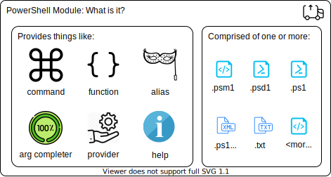
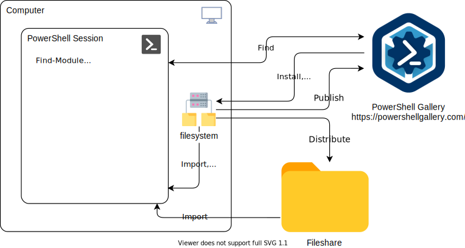

# PowerShell Modules
Some information about the constructs from which we receive [almost] all the things in PowerShell -- Modules!

The contents:
- Description / Diagram / Components
- Consumption / Management
    - `Find`, `Install`, `Save`, `Update`, `Uninstall`
    - `Import`, `Remove`
- Creation
    - write functions
    - make code to write/update module manifest
    - `Publish`
- Reference
    - `about_modules`
    - Writing a PowerShell Module

## Description / Diagram / Components
PowerShell modules, like modules that you might be familiar with in other languages, are ways to package/share/version some resource(s). Nearly everything that we use/call/leverage in PowerShell comes from a module. There are other ways to "get" new things, like via published _scripts_, but we'll leave those out as a minor use case.

"Nearly everything" includes cmdlets, functions, aliases, providers, completers, formatters, help, etc.

PowerShell modules, of what they are made:

PowerShell modules, from where we find/install/import them, etc: 

## Consumption / Management
We find, consume, remove, and uninstall the modules in the typical PowerShell verb-noun way:
| Cmdlet | What |
|--------|------|
`Find-Module` | For when we want to find a module or modules based on given criteria, like their name (can wildcard, too), or based on a known cmdlet name (using the `-Command` parameter). This looks for matching modules in all registered PSRepositories in the current PowerShell session. By default, that is the public PowerShell gallery at https://powershellgallery.com that Microsoft manages.
`Install-Module` | once we know the module(s) that we want to make available locally on our computer, we install the module (again, from a PSRepository known to this PowerShell session)
`Save-Module` | this is similar to installing a module, writes the module folder/files to the path we specify, instead of to a folder in the `${Env:\PSModulePath}`. Saving a module is useful for when we may want to first inspect the module before using it (safety first!), or for when we are putting the module in some spot that others can then consume it, too (like, at a fileshare)
`Import-Module` | once we have a module available (either installed, or saved to a path), we import it into the PowerShell session when we want to use it. Importing the module is what brings to the session all of the wonderful things that the module delivers -- cmdlets, aliases, all that goodness. And, if a module is a folder in the `${Env:\PSModulePath}` path, PowerShell (since v3) will, by default, automatically load a module if we issue a command from said module. We can control this autoloading behavior via the preference variable `$PSModuleAutoloadingPreference`. For more info about that preference variable, see `Get-Help about_Preference_Variables`
`Remove-Module` | This removes the module from the current PowerShell session (as able). This action is sometimes confused with uninstalling the module from the computer, but uninstalling is done via a different cmdlet (yes, you guessed it: via `Uninstall-Module`)
`Uninstall-Module` | For when it's time to delete the module file(s) from disk, we use this. Uninstalling does just that -- uninstalls the module from the computer.
`Update-Module` | And, for modules installed with `Install-Module`, we can easily update the local install with the current module version. Updates for the win!

## Creation
Lots of vendors and third parties provide their PowerShell goodness to us. They do so by, you know it:  creating/publishing modules!

But, yet another great thing about PowerShell:  Microsoft made it super easy for _anyone_ to create and publish modules, too! It can be as simple as a file with some function definitions and a little bit of PowerShell data. This second item is some well defined information in a `.psd1` file called the "module manifest".

And, while we can create `Binary` modules with compile C# code, we can also create modules of type `Script`, whose code is defined in PowerShell itself! Way to set us up for maximum success leveraging things that we will already know, Microsoft!

After we create our module and we're ready to make the world a better place with it, we then `Publish-Module` to publish it to some PowerShell repository (like the aforementioned PowerShell Gallery)

See the [Reference](#Reference) section below for links to the Microsoft docs on module creation, publishing, etc. This includes things like PowerShell providers, PowerShell format files (`.format.ps1xml`), and PowerShell help for your functions/scripts/modules.

## Reference
A few things for further reading, and for taking the next steps with PowerShell modules:
- PowerShell help topic for [`about_modules`](https://docs.microsoft.com/en-us/powershell/module/microsoft.powershell.core/about/about_modules) (or, see it in your PS session with, of course, `Get-Help about_modules`)
- [Writing a PowerShell Module](https://docs.microsoft.com/en-us/powershell/scripting/developer/module/writing-a-windows-powershell-module), at Microsoft Docs, with all kinds of goodness for getting going with PowerShell modules